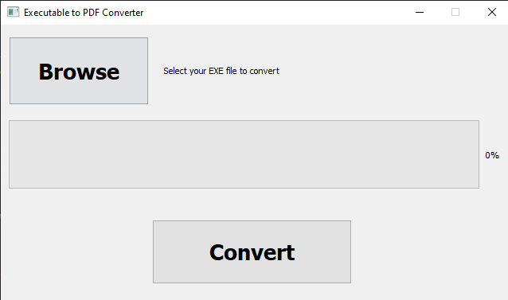

# nwjsexe2pdf

nwjsexe2pdf is a Python application designed to convert executable e-books (EXE files) into PDF format. This tool is particularly useful for libraries and educational institutions transitioning from PDF to EXE course materials.

## Features

- Convert EXE files to PDF
- Supports links and videos within the e-books
- Simple and user-friendly interface
- Progress bar to indicate conversion status
- Silent installation of necessary dependencies

## Installation

1. Download the installer from the [Releases](https://github.com/MustafaMahmoud-ILE/nwjsexe2pdf/releases) page.
2. Run the installer and follow the on-screen instructions to complete the installation.

## Usage

1. Open the `nwjsexe2pdf` application.
2. Select the EXE file you wish to convert.
3. Click the "Start" button to initiate the conversion.
4. Monitor the progress through the progress bar.
5. The output PDF will be saved in the same directory as the input EXE file.

## Prerequisites

- `wkhtmltopdf`: This application installs `wkhtmltopdf` silently during the installation process. 

## Contributing

Contributions are welcome! Please fork this repository and submit a pull request.

## License

This project is licensed under the MIT License. See the [LICENSE](LICENSE) file for details.

## Contact

For any inquiries, please contact [Mustafa Mahmoud](mailto:mustafa1015104@gmail.com).
